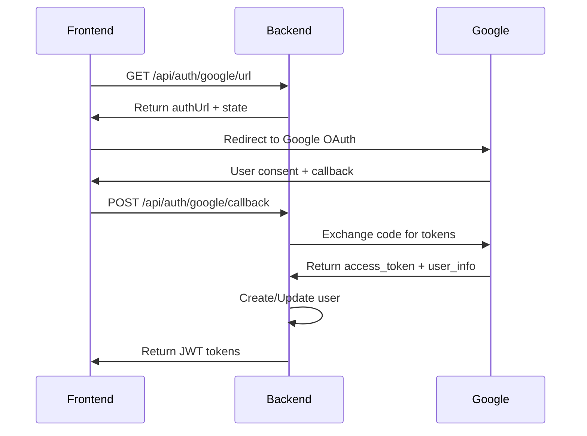

# 🚀 Google OAuth2 Implementation Summary

## ✅ Đã triển khai thành công

### 1. **Database Schema**
- ✅ `oauth_providers` table - Lưu thông tin OAuth từ Google
- ✅ `refresh_tokens` table - Quản lý refresh tokens với rotation
- ✅ Relationships với User entity

### 2. **Security Architecture**
- ✅ JWT Access Token (15 phút TTL)
- ✅ Refresh Token (30 ngày TTL) với rotation
- ✅ State parameter chống CSRF
- ✅ Device tracking cho security audit
- ✅ Password encoding với BCrypt

### 3. **API Endpoints**
```
GET  /api/auth/google/url      - Lấy Google authorization URL
POST /api/auth/google/callback - Xử lý callback từ Google
POST /api/auth/refresh         - Refresh access token
POST /api/auth/logout          - Logout và revoke tokens
```

### 4. **Services Implementation**
- ✅ `GoogleOAuth2Service` - Core OAuth2 logic
- ✅ `GoogleTokenService` - Token exchange với Google
- ✅ `JwtTokenService` - JWT token management
- ✅ `TokenRefreshService` - Token refresh logic

### 5. **Security Features**
- ✅ Role-based authorization (OWNER, PM, ADMIN, USER)
- ✅ Global exception handling
- ✅ Input validation với @Valid
- ✅ HTTPS ready configuration
- ✅ Swagger documentation

## 🔧 Cấu hình cần thiết

### Environment Variables
```bash
GOOGLE_CLIENT_ID=your-google-client-id
GOOGLE_CLIENT_SECRET=your-google-client-secret
GOOGLE_REDIRECT_URI=http://localhost:8080/api/auth/google/callback
JWT_SECRET=your-super-secret-jwt-key-at-least-32-characters
```

### Dependencies đã thêm
```gradle
implementation 'org.springframework.boot:spring-boot-starter-oauth2-client'
implementation 'com.google.api-client:google-api-client:2.2.0'
implementation 'org.springframework.security:spring-security-crypto'
implementation 'org.springframework.boot:spring-boot-starter-data-redis'
```

## 🔄 OAuth2 Flow



## 📱 Frontend Integration

### 1. Initiate OAuth Flow
```javascript
const response = await fetch('/api/auth/google/url');
const { authUrl, state } = await response.json();
localStorage.setItem('oauth_state', state);
window.location.href = authUrl;
```

### 2. Handle Callback
```javascript
const urlParams = new URLSearchParams(window.location.search);
const code = urlParams.get('code');
const state = urlParams.get('state');

const response = await fetch('/api/auth/google/callback', {
    method: 'POST',
    headers: { 'Content-Type': 'application/json' },
    body: JSON.stringify({ code, state })
});

const { accessToken, refreshToken } = await response.json();
```

### 3. Token Refresh
```javascript
const response = await fetch('/api/auth/refresh', {
    method: 'POST',
    headers: { 'Content-Type': 'application/json' },
    body: JSON.stringify({ refreshToken })
});
```

## 🛡️ Security Best Practices Implemented

### ✅ Đã implement:
- State parameter validation
- JWT short expiration (15 phút)
- Refresh token rotation
- Device tracking
- Password hashing
- Role-based access control
- Input validation
- Global exception handling

### 🔄 Recommended additions:
- Rate limiting
- IP whitelist
- Audit logging
- Multi-factor authentication
- Session management

## 🚀 Deployment Checklist

### Development
- [ ] Set up Google Cloud Console
- [ ] Configure environment variables
- [ ] Run database migrations
- [ ] Test OAuth flow

### Production
- [ ] HTTPS configuration
- [ ] Production Google OAuth credentials
- [ ] Secure JWT secret
- [ ] Redis for refresh tokens
- [ ] Monitoring và logging

## 📚 Documentation

- ✅ [Setup Guide](./GOOGLE_OAUTH2_SETUP.md) - Chi tiết setup
- ✅ API Documentation via Swagger UI
- ✅ Database schema documentation
- ✅ Security implementation guide

## 🎯 Next Steps

1. **Testing**: Implement unit tests cho OAuth services
2. **Monitoring**: Add logging và metrics
3. **Performance**: Optimize database queries
4. **Security**: Add rate limiting và audit logs
5. **Documentation**: API documentation với examples

---

## 🔗 Quick Start

1. Clone repository
2. Set environment variables
3. Run `./gradlew bootRun`
4. Access Swagger UI: `http://localhost:8080/swagger-ui.html`
5. Test OAuth flow: `GET /api/auth/google/url`

**🎉 Google OAuth2 Login đã sẵn sàng cho production!**